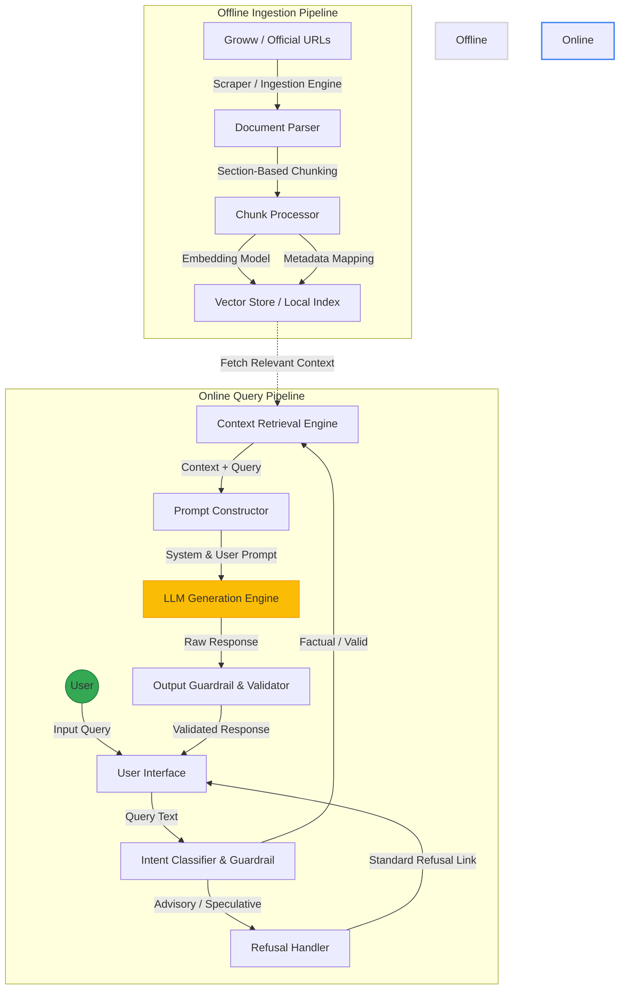
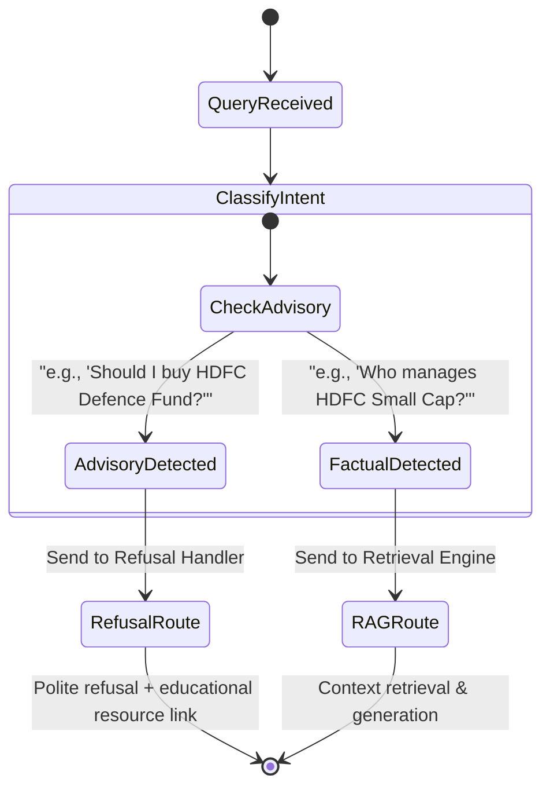
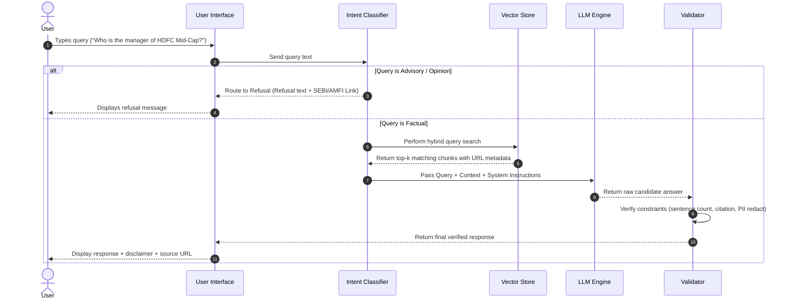

# System Architecture: Mutual Fund FAQ Assistant (Facts-Only Q&A)

This document outlines the detailed system architecture for the Retrieval-Augmented Generation (RAG)-based Mutual Fund FAQ Assistant. The system is designed to provide facts-only, source-backed answers using curated official data sources while strictly refusing to offer investment advice or recommendations.

---

## 1. High-Level Architecture Overview

The assistant follows a classic modular RAG architecture enhanced with safety and compliance guardrails. The workflow is divided into two primary phases:
1.  **Offline Ingestion Pipeline**: Ingests, parses, chunks, and indexes mutual fund data.
2.  **Online Query & Inference Pipeline**: Classifies user intent, retrieves relevant context, prompts the LLM under strict constraints, and filters the output.

### System Architecture Diagram


---

## 2. Component Specifications

### 2.1 Ingestion & Parsing Pipeline (Scalable)
Although currently restricted to 5 specific Groww mutual fund URLs, the ingestion engine must be built using a pluggable, scalable design to support any number of inputs (websites, PDFs, factsheets).

*   **Ingestion Engine**: Uses a scraper/parser utility (e.g., `BeautifulSoup`, `Playwright`, or `requests`) configured with custom parsers for Groww and other official source structures.
*   **Metadata Extractor**: Automatically captures:
    *   `source_url`: The exact URL the text was pulled from.
    *   `last_updated`: Date of extraction or document publication.
    *   `fund_name`: Associated mutual fund scheme (e.g., *HDFC Small Cap Fund*).
    *   `data_type`: Category of information (e.g., `Fund Management`, `Expense Ratio`, `Exit Load`, `Historical Returns`).
*   **Text Splitter / Chunker**: Employs a **Section-Aware Chunking** strategy instead of simple token-count splitters. This ensures unified tables (like fund management matrices, SIP rules, or expense tiers) are kept in a single chunk to prevent context fragmentation.
*   **Vector Store & Embeddings**:
    *   **Embeddings**: Text chunks are converted to vectors using a standard dense model (e.g., `sentence-transformers` or an equivalent local/cloud embedding model).
    *   **Storage**: Cached locally in a lightweight database (e.g., `FAISS` or `ChromaDB`) for easy migration to cloud vector databases in the future.

### 2.2 Intent Classifier & Guardrails (Routing)
To satisfy the strict compliance requirement (avoiding advisory content, opinions, or returns calculations), the system utilizes an upfront classifier:



*   **Advisory Detection**: Evaluates whether the question contains phrases like *"should I invest"*, *"which is better"*, or *"predict returns"*. If detected, it bypasses RAG retrieval and directly triggers the **Refusal Handler**.
*   **Refusal Handler**: Responds with a polite, pre-defined message reinforcing the facts-only scope and provides a helpful, compliant external education link (e.g., [SEBI Investor Education](https://investor.sebi.gov.in) or [AMFI](https://www.amfiindia.com)).

### 2.3 Context Retrieval Engine
*   **Query Matching**: Calculates similarity between the user's query and stored chunk vectors.
*   **Metadata Filtering**: Optionally filters chunks based on detected scheme names to restrict retrieval to the specific fund asked about.
*   **Hybrid Search (Recommended)**: Combines Semantic Vector Search with BM25 Keyword Search. Keyword matching is critical for exact match queries like *"exit load"* or *"expense ratio"* where specific terminology matters.

### 2.4 LLM Prompt Construction & Generation
The LLM is prompted under extreme constraints. The system prompt is structured as follows:

```
You are a facts-only Mutual Fund FAQ Assistant. Your role is to answer questions strictly using the provided context.

CONSTRAINTS:
1. Base your answer ONLY on the provided context. If the information is not present, refuse to answer.
2. Under no circumstances should you provide investment advice, comparisons, or recommendations.
3. Your answer must be highly concise and MUST not exceed 3 sentences.
4. You must cite the exact source URL in your response in the format: [Source Name](URL).
5. Never calculate or predict future performance.

CONTEXT:
{retrieved_context}

USER QUERY:
{user_query}
```

### 2.5 Output Guardrail & Validator (Post-Processing)
Before sending the response to the user, a validation script checks compliance:
*   **PII Check**: Scans output using Regex/NER models to ensure no Aadhaar, PAN, OTP, email, or phone numbers are exposed.
*   **Sentence Count Validator**: Counts the sentences in the generated text. If it exceeds 3 sentences, it truncates or requests a regeneration with a lower temperature.
*   **Source Verification**: Parses the text to verify that exactly one valid citation link from the ingested corpus is present.
*   **Metadata Injector**: Appends the mandatory footer:
    `Last updated from sources: <extraction_date>`.

---

## 3. Sequence Flow (Query Lifecycle)



---

## 4. Scalability Strategy for Ingestion
To ensure the system easily transitions from 5 URLs to hundreds or thousands of documents in the future:
1.  **Configuration-Driven Ingestion**: Target URLs, AMC mappings, and parsing selectors are stored in a configuration file (`config/sources.json` or `config/sources.yaml`). Adding new sources only requires updating this file rather than editing code.
2.  **Incremental Ingestion**: The scraping pipeline maintains a hash of the scraped content. During updates, it only chunks and embeds pages whose content hashes have changed, optimizing compute resources.
3.  **Standardized Document Object Model**: Regardless of whether the source is a web page, PDF factsheet, or JSON API, all raw data is parsed into a uniform `Document` object structure with fields for `content`, `source`, `category`, and `timestamp` before entering the processing pipeline.

---

## 5. Technology Stack Recommendations

*   **Programming Language**: Python 3.10+ (for rich library support in scraping, NLP, and RAG).
*   **Web Scraping / Ingestion**: `requests` + `BeautifulSoup` (lightweight) or `Playwright` (if Groww relies on client-side JS rendering).
*   **RAG Orchestration**: `LlamaIndex` or `LangChain` (simplifies chunking, metadata attachment, and query execution).
*   **Vector Database**: `ChromaDB` or `FAISS` (runs locally, requires no external server setup).
*   **LLM API**: Groq API (utilizes models like `llama3-8b-8192` or `llama3-70b-8192` for fast, low-latency generation).
*   **Web Interface**: `Streamlit` or a lightweight `HTML/CSS/JS` frontend powered by a `FastAPI` backend.

---

## 6. Automated Data Refresh Scheduling

To ensure the vector database always serves the latest, most up-to-date information, the system supports automated, scheduled data ingestion.

### Proposed Scheduling Designs:

1. **System-Level Task Scheduler (Recommended for Production)**
   - **Mechanism**: Use standard operating system schedulers (such as `cron` in Linux or `Windows Task Scheduler` in Windows) to execute the ingestion pipeline as an independent background script at regular intervals (e.g., daily at midnight).
   - **Command Executed**: `.\.venv\Scripts\python -m src.data.ingest`
   - **Advantages**: 
     - Completely decoupled from the application server/UI thread, preventing resource conflicts or server crashes from affecting ingestion.
     - Incremental manifest hashing checks if the data has actually changed on Groww before running embeds, minimizing API calls and processing.

2. **In-Process Daemon Thread (Self-Contained Deployment)**
   - **Mechanism**: Run a persistent background daemon thread inside the Streamlit server lifecycle (or a lightweight Python scheduler like `schedule` or `APScheduler`) that wakes up periodically to run the ingestion pipeline.
   - **Advantages**: Requires no external OS configurations, making deployment fully self-contained.

